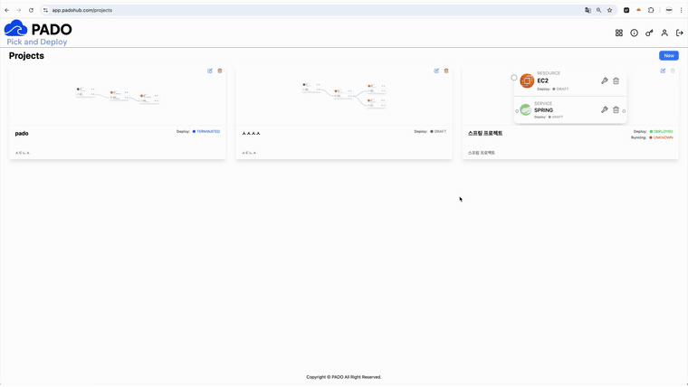
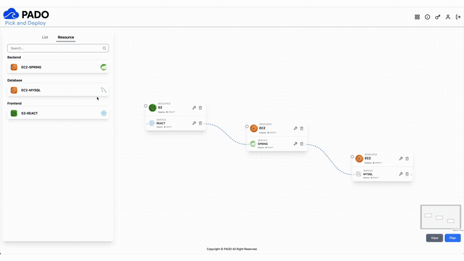
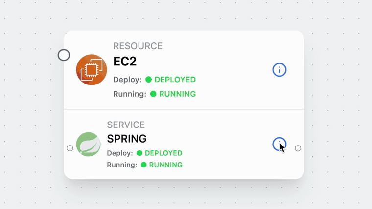
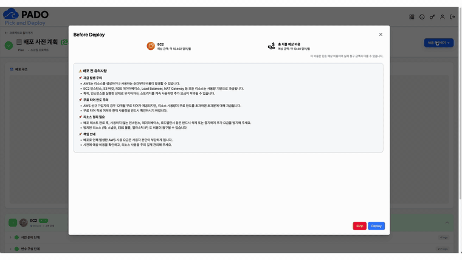
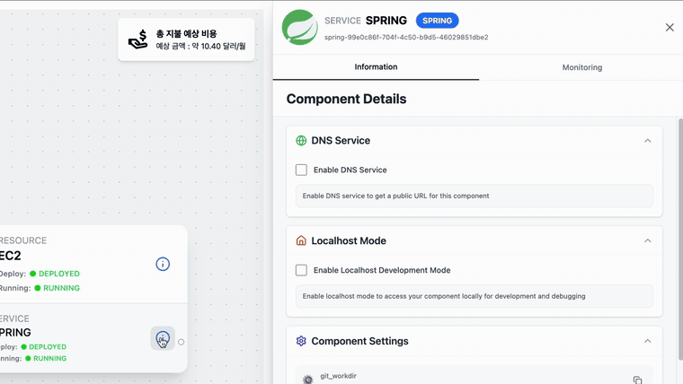
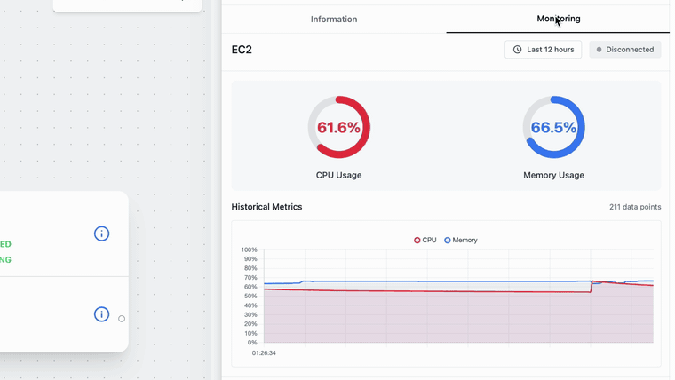
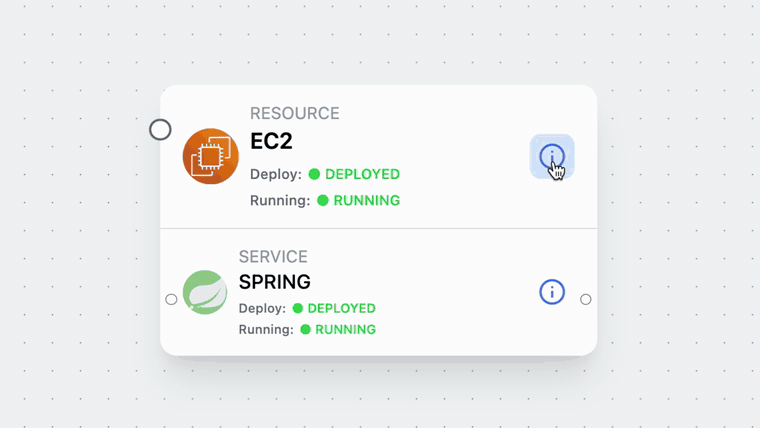
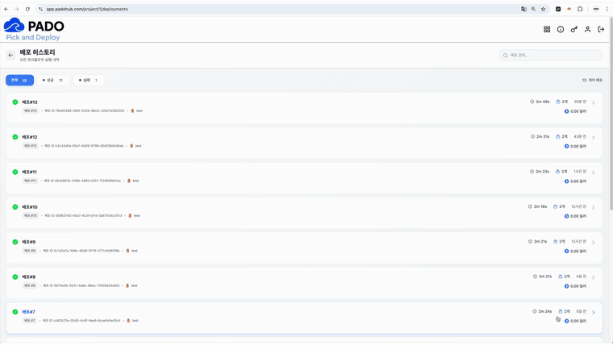
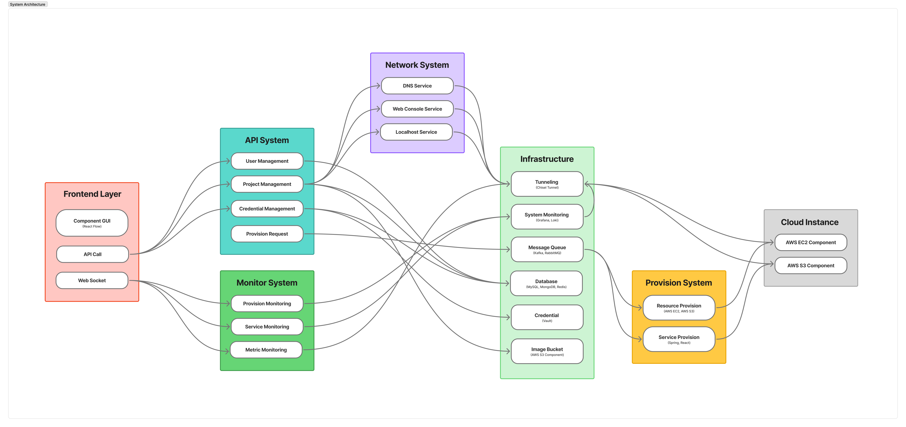
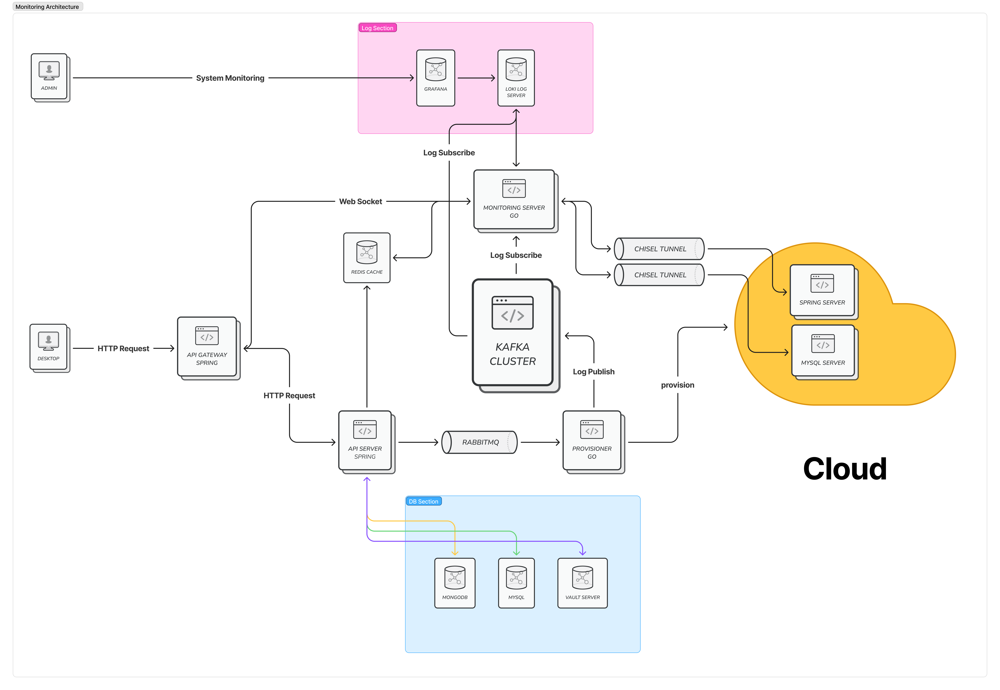

# PADO: Pick And DeplOy

> 개발자의 아이디어를 현실로 만드는 가장 빠른 방법  
> GUI 기반 원클릭 클라우드 자동화 플랫폼

PADO는 복잡한 클라우드 배포 과정을 Drag & Drop 기반의 시각적 설계와 원클릭 배포 흐름으로 단순화하는 플랫폼입니다. 사용자는 YAML, Terraform, Ansible, SSH, 보안 그룹, 포트, DNS 설정을 직접 다루지 않고도 웹 애플리케이션 아키텍처를 설계하고 AWS 환경에 배포할 수 있습니다.

캡스톤/해커톤/초기 스타트업처럼 DevOps 전담 인력이 부족한 팀이 `localhost`에 머무르지 않고 실제 서비스 URL, 모니터링, 배포 이력, 원격 접속까지 갖춘 실행 가능한 결과물을 만들 수 있도록 하는 것이 목표입니다.



## Materials

- [최종 발표자료 보기](../assets/docs/pado-final-presentation.pdf)
- 기능별 시연 GIF는 아래 Demo Flow에서 확인할 수 있습니다.

## Why PADO

서비스를 만들었지만 배포하지 못하면 코드는 사용자를 만나지 못합니다. 실제 팀 프로젝트에서는 다음 문제가 반복됩니다.

- 서버 생성, 네트워크, 보안 그룹, SSH 키, 포트, 환경변수 설정이 모두 분리되어 있어 실수가 잦습니다.
- Terraform, Docker, CI/CD, 모니터링 등 배포를 위해 학습해야 할 도구가 많습니다.
- 팀원마다 로컬 환경이 달라 “내 컴퓨터에서는 되는데 배포하면 안 되는” 상황이 반복됩니다.
- 발표나 포트폴리오에는 스크린샷만 남고, 실제 서비스 링크를 제공하지 못하는 경우가 많습니다.

PADO는 이 문제를 “개발과 서비스 런칭 사이의 배포 장벽”으로 정의하고, 배포 경험이 부족한 개발자도 실제 클라우드 환경을 다룰 수 있도록 제품화했습니다.

## Core Features

| 기능 | 설명 |
| --- | --- |
| GUI Architecture Builder | React Flow 기반 캔버스에서 컴포넌트를 Drag & Drop으로 배치하고 의존 관계를 연결합니다. |
| Zero Config Deployment | 사용자가 입력한 설정을 바탕으로 Terraform 템플릿과 Ansible Playbook을 자동 생성합니다. |
| One-Click Deploy | 버튼 한 번으로 인프라 생성, 서버 설정, 애플리케이션 배포를 실행합니다. |
| Auto DNS | 배포된 서비스에 접근 가능한 도메인을 자동으로 연결합니다. |
| Web Remote Desktop | 별도 SSH 클라이언트 없이 웹에서 원격 서버에 접근할 수 있습니다. |
| Live Logs & Metrics | WebSocket 기반으로 배포 상태, Provisioner 로그, 서비스 로그, 노드 메트릭을 실시간 스트리밍합니다. |
| Deployment History | 배포 이력을 시간순으로 관리하여 변경 흐름을 추적하고 문제 발생 시 빠르게 복구할 수 있습니다. |

## Demo Flow

최종 발표 자료와 기능별 시연 영상을 기준으로 PADO의 사용 흐름을 정리했습니다.

| 순서 | 데모 | 설명 |
| --- | --- | --- |
| 1 | 로그인 및 메인 대시보드 | 프로젝트와 클라우드 크레덴셜을 관리합니다. |
| 2 | 컴포넌트 Drag & Drop | 캔버스에서 인프라 컴포넌트를 배치하고 연결합니다. |
| 3 | 컴포넌트 설정 | 인스턴스, 포트, 환경변수 등 배포 옵션을 선택합니다. |
| 4 | 설정 적용 | 선택한 설정을 배포 가능한 구성으로 반영합니다. |
| 5 | 배포 실행 | 원클릭으로 인프라 생성과 애플리케이션 배포를 시작합니다. |
| 6 | DNS 서비스 | 배포된 서비스를 IP 대신 도메인으로 공유합니다. |
| 7 | 모니터링 | 로그와 메트릭을 실시간으로 확인합니다. |
| 8 | 원격 데스크톱 접속 | 웹에서 서버에 직접 접근합니다. |
| 9 | 배포 이력 | 배포 변경 흐름을 추적하고 복구 기반을 마련합니다. |

### GUI Architecture Builder

복잡한 YAML을 직접 작성하지 않고, 캔버스에서 컴포넌트를 배치하고 연결해 아키텍처를 설계합니다.



### Zero Config

컴포넌트별 인스턴스, 포트, 환경변수 등 배포 옵션을 화면에서 선택하고 적용합니다.



### One-Click Deploy

설계된 아키텍처를 기준으로 인프라 생성, 서버 설정, 애플리케이션 배포를 한 번에 실행합니다.



### Auto DNS

배포된 서비스를 IP 주소 대신 도메인으로 공유할 수 있도록 연결합니다.



### Live Monitoring

배포 상태, 서비스 로그, 노드 메트릭을 실시간으로 확인합니다.



### Web Remote Desktop

별도 SSH 클라이언트 없이 웹에서 서버에 접속합니다.



### Deployment History

배포 이력을 시간순으로 관리하여 변경 흐름과 복구 지점을 확인합니다.



## Architecture

PADO는 React Flow 기반 프론트엔드, API/Monitor/Network/Provision 계층, 그리고 AWS 클라우드 인스턴스를 연결하는 MSA 구조로 설계했습니다.



서비스 운영 관점에서는 API Server, Provisioner, Monitoring Server, Chisel Tunnel, 메시지 큐, 로그/메트릭 스택이 연결됩니다. Chisel 터널을 통해 외부 클라우드 로그와 서비스 접근 경로를 안전하게 릴레이하고, DNS와 모니터링 기능도 같은 네트워크 계층 위에서 제공합니다.



### Backend Components

- `api-server`: 프로젝트, 배포 요청, 인증, 설정값, 배포 이력의 중심 API를 담당합니다.
- `provisioner-server`: 사용자 설정을 Terraform/Ansible 실행 단위로 변환하고 실제 클라우드 리소스를 생성합니다.
- `monitoring-server`: RabbitMQ 큐와 WebSocket을 통해 로그/메트릭/상태 이벤트를 표준 JSON 구조로 전달합니다.
- `network-server`: DNS, 외부 접근 URL, 원격 접속 흐름을 관리합니다.
- `chisel-server`: Chisel 기반 암호화 터널을 통해 프라이빗 클라우드 리소스와 중앙 서버를 안전하게 연결합니다.

## Technical Highlights

### 1. Visual IaC Pipeline

React Flow 캔버스에서 설계한 컴포넌트 그래프를 배포 가능한 인프라 명세로 변환합니다. 사용자의 선택값은 Terraform 리소스 정의와 Ansible Playbook으로 이어지며, AWS 리소스 생성부터 애플리케이션 배포까지 자동화됩니다.

### 2. Secure Tunneling Architecture

AWS 내부의 서비스와 노드 메트릭을 외부에 직접 노출하지 않고 Chisel 터널을 통해 중앙 서버로 릴레이합니다. 이를 통해 모니터링, DNS, 원격 접속 기능을 제공하면서도 프라이빗 리소스 접근을 통제할 수 있습니다.

### 3. Real-Time Observability

배포 상태, Provisioner 로그, 서비스 로그, EC2 메트릭을 단일 WebSocket 연결로 전달합니다. 프론트엔드 처리를 단순화하기 위해 모든 메시지는 다음과 같은 표준 구조로 래핑됩니다.

```json
{
  "type": "status | log | metric",
  "payload": {}
}
```

### 4. Deployment Traceability

배포 이력을 시간순으로 보관하여 어떤 설정 변경이 어떤 결과를 만들었는지 추적할 수 있습니다. 이는 장애 원인 파악과 복구 시나리오의 기반이 됩니다.

## Tech Stack

| Area | Stack |
| --- | --- |
| Frontend | React, React Flow, WebSocket |
| Backend | Go, REST API, WebSocket |
| Provisioning | Terraform, Ansible |
| Cloud | AWS EC2, VPC, Security Group, DNS |
| Tunneling | Chisel |
| Messaging | RabbitMQ |
| Monitoring | Prometheus, Grafana, Loki |

> 일부 레포는 보안 및 인프라 설정 정보 보호를 위해 private로 운영됩니다. 공개 README에는 프로젝트 구조와 핵심 설계 의도를 정리하고, 민감한 코드/환경값은 포함하지 않습니다.

## Component Map

| Component | Role |
| --- | --- |
| Frontend Dashboard | 사용자가 아키텍처를 설계하고 배포 상태를 확인하는 웹 대시보드 |
| API Server | 프로젝트, 배포, 인증, 설정, 이력 관리를 담당하는 중앙 API |
| Provisioner Server | Terraform/Ansible 기반 클라우드 리소스 생성 및 애플리케이션 배포 |
| Monitoring Server | 로그/메트릭/상태 이벤트 수집 및 WebSocket 스트리밍 |
| Network Server | DNS, 외부 접근 URL, 네트워크 서비스 관리 |
| Chisel Server | 프라이빗 리소스 접근을 위한 터널 세션 및 포트 풀 관리 |
| Docs | 발표 자료, 아키텍처 문서, 데모 영상, 운영 가이드 |

## Team

| 이름 | 역할 | 주요 기여 |
| --- | --- | --- |
| 김태형 | Backend & Infra | API 서버, Provisioner 연동, Chisel 터널링, 모니터링 서버, 배포 아키텍처 |
| 양상훈 | Frontend & UI/UX | 대시보드 UI, React Flow 기반 아키텍처 빌더, 로그인/프로젝트/모니터링 화면 |

## Roadmap

- GCP, Azure 등 멀티 클라우드 지원
- GitHub Webhook 기반 CI/CD 자동 배포
- 알람 및 장애 감지 기능
- Django, NestJS, PostgreSQL, MongoDB 등 공식 템플릿 확장
- PADO Hub: 템플릿 마켓플레이스, 프로젝트 쇼케이스, 트러블슈팅 커뮤니티

## Project Status

PADO는 2025년 캡스톤 프로젝트로 개발되었으며, GUI 기반 인프라 설계, 원클릭 배포, 모니터링, DNS, 원격 접속, 배포 이력 기능을 중심으로 MVP를 구현했습니다.
